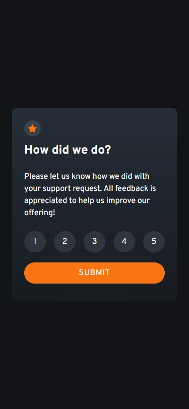
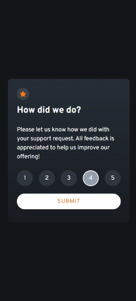
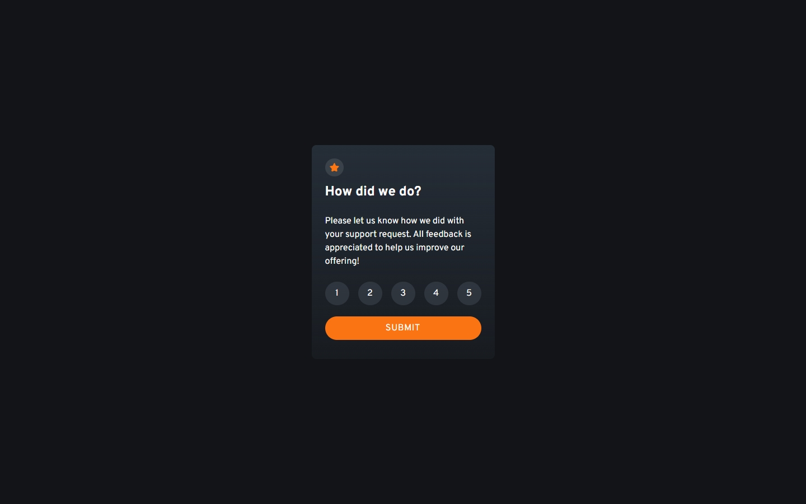

# Frontend Mentor - Interactive rating component solution

This is a solution to the [Interactive rating component challenge on Frontend Mentor](https://www.frontendmentor.io/challenges/interactive-rating-component-koxpeBUmI). Frontend Mentor challenges help you improve your coding skills by building realistic projects. 

## Table of contents

- [Overview](#overview)
  - [The challenge](#the-challenge)
  - [Screenshots](#screenshots)
  - [Links](#links)
- [My process](#my-process)
  - [Built with](#built-with)
  - [Continued development](#continued-development)
- [Author](#author)
- [Acknowledgments](#acknowledgments)

## Overview

### The challenge

Users should be able to:

- View the optimal layout for the app depending on their device's screen size
- See hover states for all interactive elements on the page
- Select and submit a number rating
- See the "Thank you" card state after submitting a rating

### Screenshots

 
 
 

### Links

- Solution URL: [Add solution URL here](https://www.frontendmentor.io/solutions/interactive-rating-component-solution-react-tailwindcss-e3LMIqZmdn)
- Live Site URL: [Add live site URL here](https://interactive-rating-component-volinha.vercel.app)

## My process

### Built with

- CSS Grid
- Mobile-first workflow
- [React](https://reactjs.org/) - JS library
- [ViteJS](https://nextjs.org/) - Frontend tooling
- [TailwindCSS](https://tailwindcss.com) - Easier CSS styling

### Continued development

- [ ] Add alternate text to images
- [ ] Add landmarks
- [ ] Divide screens more clearly code-wise
- [ ] Add a `reset` button
- [ ] Remove unecessary dependencies

## Author

- Github - [Vinícius (volinha)](https://github.com/volinha)
- Frontend Mentor - [@volinha](https://www.frontendmentor.io/profile/volinha)
- Twitter - [@volafernandes](https://www.twitter.com/volafernandes)
